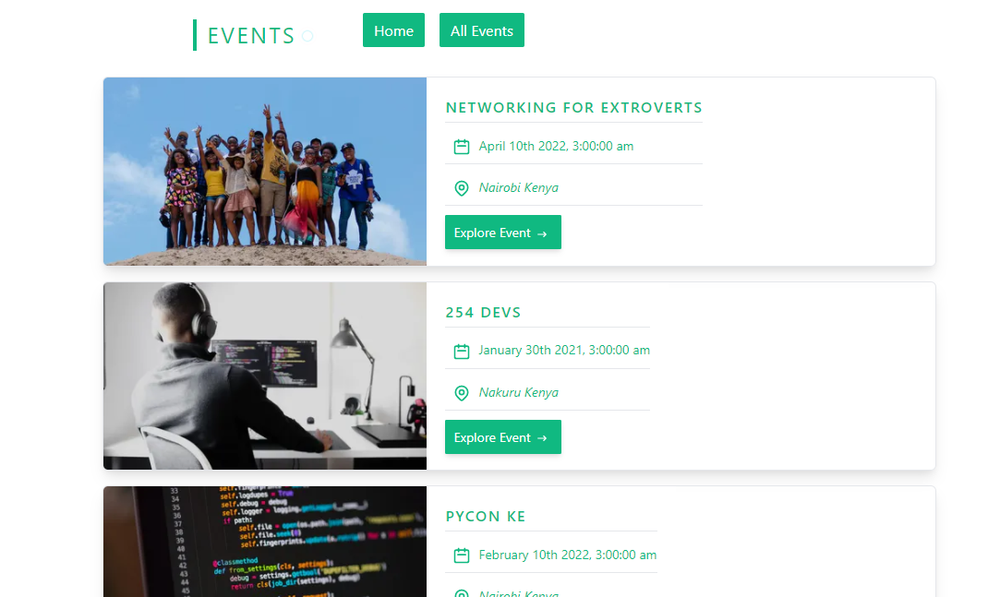
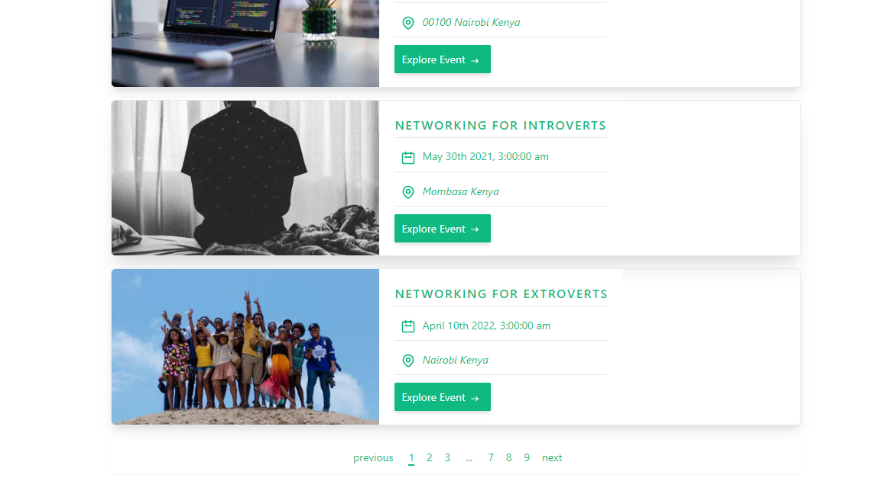

# Events UI




## Description

An event web application that allows users to view available events and share them with other users. I used Next js a framework for react mainly cause I was quite intrigued with the file based routing.

## How to install and run

Clone the repository and run the following command:

```bash
npm install
```

This will ensure that all node dependencies are installed.
From the root directory of the project run the following command:

```bash
npm run dev
```

This will start the development server.
If you want to run the production version of the application run the following command:

```bash
npm run build
```

This will build the application and create a production version of the application.
From here you can run the following command to start the application:

```bash
npm run start
```

or serve the generated static files:
